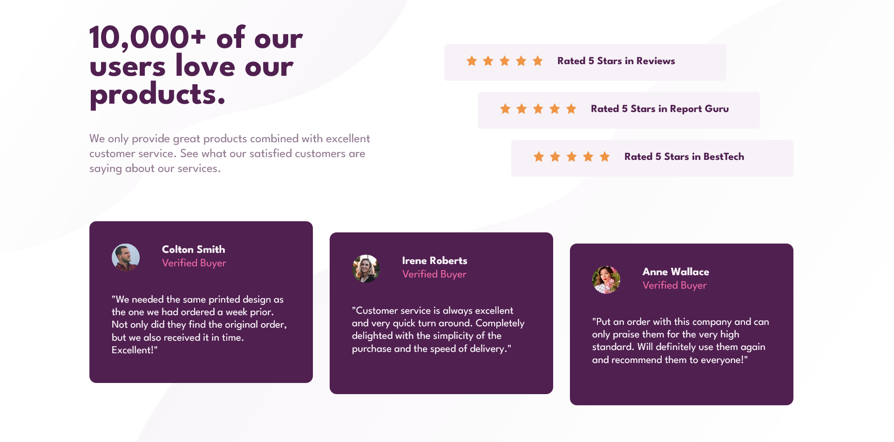

# Frontend Mentor - Social proof section solution

This is a solution to the [Social proof section challenge on Frontend Mentor](https://www.frontendmentor.io/challenges/social-proof-section-6e0qTv_bA). Frontend Mentor challenges help you improve your coding skills by building realistic projects. 

- View the optimal layout for the section depending on their device's screen size

- [Solution](https://www.frontendmentor.io/solutions/social-proof-section---html-css-QLnoQ5GObV)
- [Live Site](https://lspacka.github.io/FEM-social-proof-section/)

### Built with

- HTML
- CSS